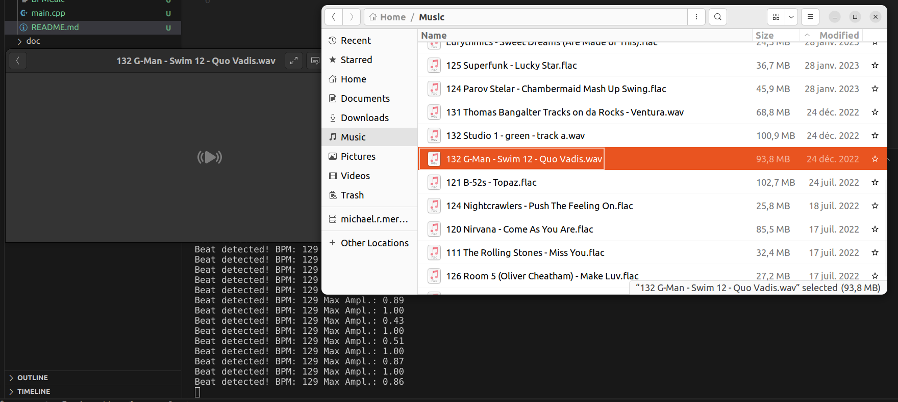

# A simple program to analyze BPM with Adam Starks BTrack.

## Compiled with:

```
g++ -o BPMCalc main.cpp lib/kiss_fft130/kiss_fft.c -lportaudio -lBTrack -lsamplerate -L./lib -I./include -I./lib/kiss_fft130
```


